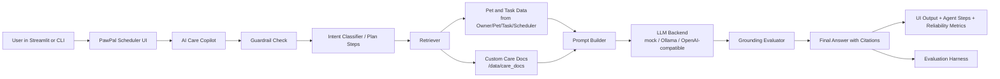

```mermaid
flowchart LR
    A[User in Streamlit or CLI] --> B[PawPal Scheduler UI]
    B --> C[AI Care Copilot]
    C --> D[Guardrail Check]
    D --> E[Intent Classifier / Plan Steps]
    E --> F[Retriever]
    F --> G1[Pet and Task Data\nfrom Owner/Pet/Task/Scheduler]
    F --> G2[Custom Care Docs\n/data/care_docs]
    G1 --> H[Prompt Builder]
    G2 --> H
    H --> I[LLM Backend\nmock / Ollama / OpenAI-compatible]
    I --> J[Grounding Evaluator]
    J --> K[Final Answer with Citations]
    K --> L[UI Output + Agent Steps + Reliability Metrics]
    K --> M[Evaluation Harness]
```